## 漏洞介绍

Thinkphp 在使用缓存的时候是将数据 序列化 然后存进一个 php 文件中这就导致了我们在知道写入文

件路径的情况下可以直接 getshell

## 漏洞利用

该漏洞形成最关键的一点是，需要使用框架时，有使用缓存，才能利用这个漏洞

官方介绍缓存

所以我们重新修改 **application/index/controller/Index.php** 中的代码

```php
<?php 

namespace app\index\controller; 

use think\Cache;//利用缓存类 

class Index 

{ 

public function index() 

{ 

Cache::set("name",input("get.username")); 

//接收username参数 

return 'Cache success'; 

} 

} 
```

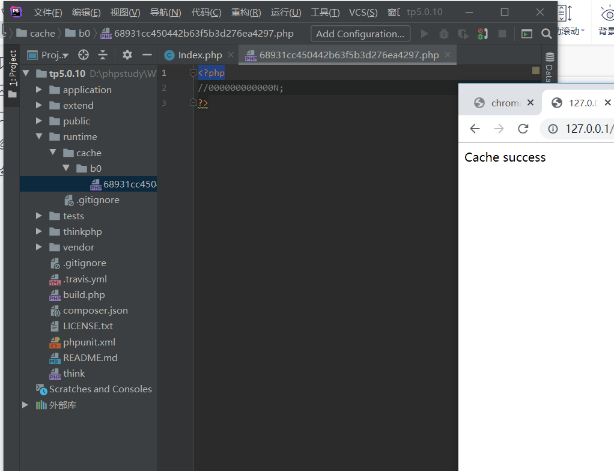

访问一下,可以发现缓存

当我们输入 1%0A%0Deval($_POST[0]);// 成功写入shell

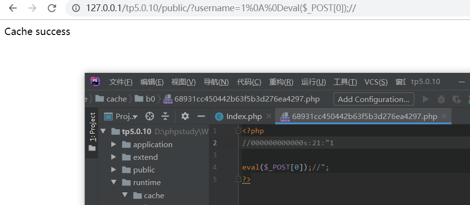

这里我们写不管可不可以访问到，接下来我们分析为什么可以写入shell。

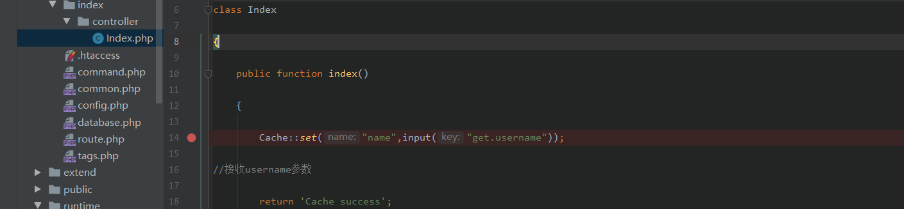

首先打个断点,我们在这里先传参username=1eval($_POST[0]);

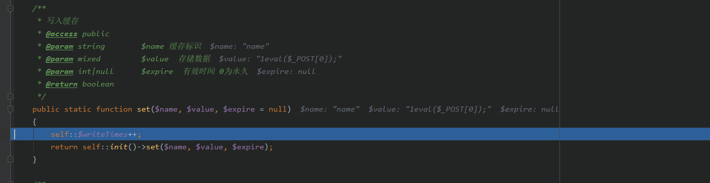

可以通过注释知道 set 方法介绍的第一个参数是缓存标识,第二个参数是 存储数据，第

三个是有限时间。默认是永久。

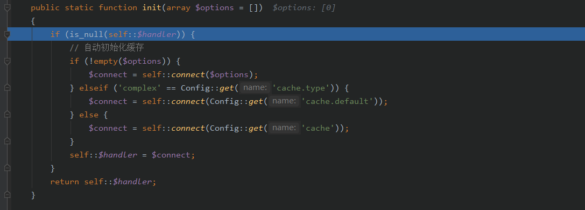

可以看到数据又通过 init 函数进行处理，跟进self::connect发现创建了一个类实例，该类由 **cache** 的配置项

**type** 决定，默认情况下其值为 **File** 

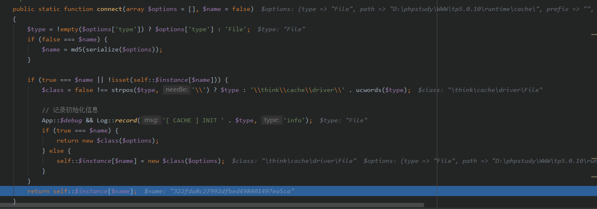

然后在set中

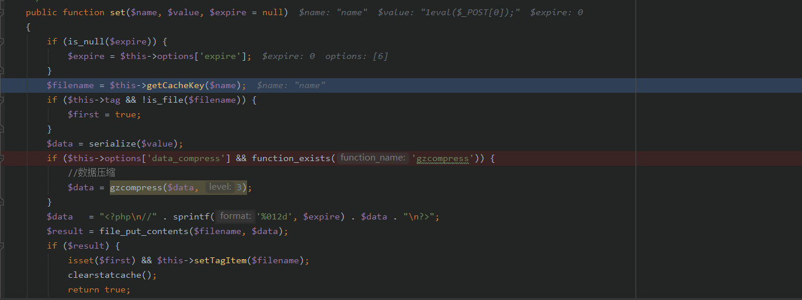

跟进getCanekey

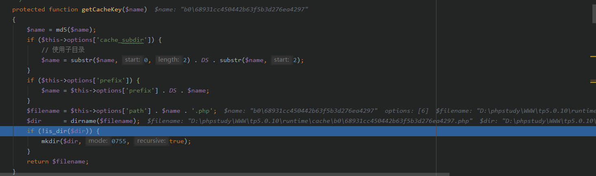

发现命名规则,取name的md5值的前两个做文件夹名,后面的做文件名。如果应用

程序还设置了前缀 $this->options['prefix'] ，那么缓存文件还将多一个上级目录。

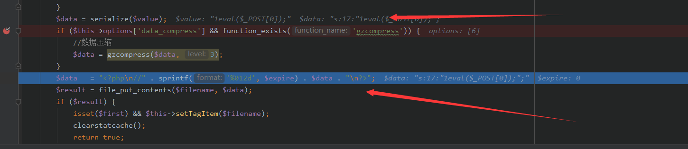

将数据反序列化,然后file_put_contents,查看一下我们的缓存文件

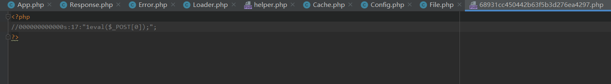

发现是被注释了的,这就跟我们exp中的username=1%0A%0Deval($_POST[0]);//有关了

其实%0a和%0d就是\n和\r,拿来绕过注释符https://www.jianshu.com/p/23804b0b03c8


总结一下流程图

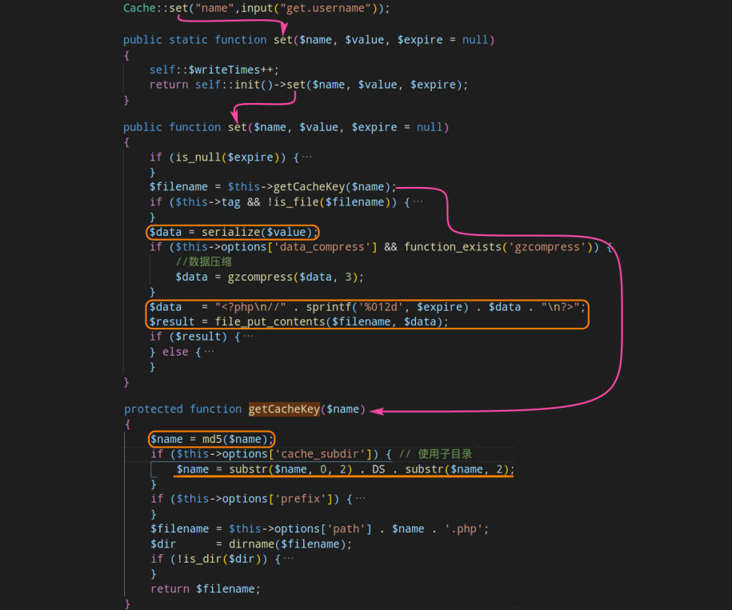

## 漏洞修复

官方的修复方法是：将数据拼接在 **php** 标签之外，并在 **php** 标签中拼接 **exit()** 函数

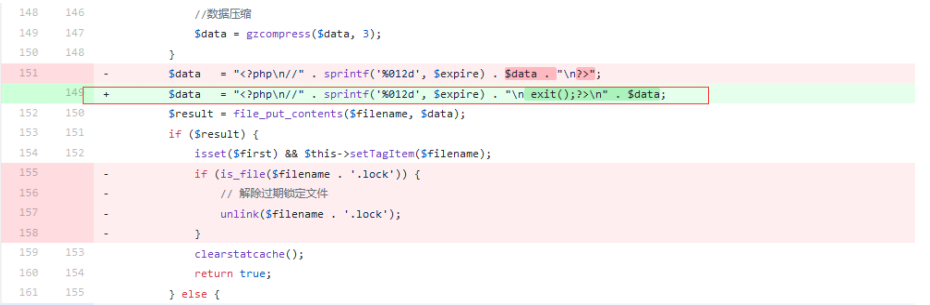